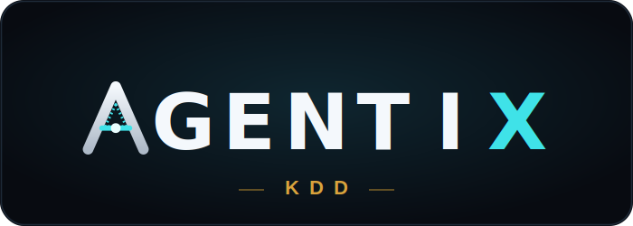

<div align="center">



### La armadura de tu IA de código.

<p>


</p>

**Un equipo de Dev's de un solo hombre.**

[English](README.md) · Español

</div>

---

## Qué es

**Agentix KDD** no es otra IA que programa por ti. Es la **armadura** que se le pone a la IA que ya usas — Claude Code o Cursor — para que **recuerde, no rompa lo que funcionaba, y no se contradiga**.

Vive **dentro de tu proyecto**: lee tu código, guarda cada decisión y cada error en una memoria persistente, y usa todo eso para que la siguiente tarea sea más segura que la anterior. Tú sigues con tu editor de siempre; Agentix lo blinda por debajo.

> *KDD = Knowledge-Driven Development — desarrollo guiado por el conocimiento acumulado del propio proyecto. (Paquete npm: `agentic-kdd`.)*

---

## El problema que resuelve

Abres Cursor o Claude Code. Le explicas tu proyecto *otra vez*. La IA empieza de cero *otra vez*. Rompe algo que ya funcionaba *otra vez*. Cambia una regla de negocio sin acordarse de por qué estaba así.

No estás programando — estás cuidando el contexto a mano. **Agentix se encarga de eso.**

---

## Las tres piezas de la armadura

| | Pieza | Qué hace |
|---|-------|----------|
| ⚓ | **Ancla** — memoria | Recuerda decisiones, reglas y errores entre sesiones. Búsqueda semántica real (embeddings locales) para traer lo relevante en el momento justo. |
| 🔧 | **Palanca** — verificación | Antes de aceptar un cambio, **corre los tests y comprueba que no rompió lo que funcionaba**. Si algo se rompe, lo dice — no declara "verde" en falso. |
| 🔨 | **Martillo** — autonomía | Detecta y corrige problemas por su cuenta (incluida seguridad), y te lo reporta. Tú lees el resultado. |

---

## Cómo funciona

Agentix usa una **memoria de 4 capas** (arquitectura CoALA) guardada en **SQLite dentro de tu proyecto** — tuya, sin nube, sin suscripción:

```
Working    → contexto de la tarea actual
Procedural → patrones, errores y decisiones (las reglas de tu proyecto)
Episódica  → qué se intentó, en qué orden, por qué funcionó o falló
Semántica  → grafo de módulos, APIs y dependencias — qué rompe qué
```

Sobre esa memoria corren los **gates** que protegen tu trabajo:

- **Spec Gate** — frena un cambio que contradice una regla de negocio guardada (ej. cambiar una tarifa fijada) y pide confirmación.
- **Regression Guard + TDD Gate** — corren la suite real; si un cambio rompe un test que pasaba, se detienen.
- **Security Gate** — revisa los archivos sensibles (auth, multi-tenant) antes de escribir.

---

## Inicio rápido

```bash
# 1. Instalar el CLI
npm install -g agentic-kdd

# 2. En tu proyecto
cd tu-proyecto
akdd init

# 3. Abre en Claude Code o Cursor y escribe:
aa: configurar
```

Listo. Agentix lee tu proyecto y se configura solo. A partir de ahí, cada tarea empieza con `aa:`.

---

## Comandos

```bash
# Pipeline principal
aa: [cualquier tarea]      # ciclo autónomo: analiza · construye · prueba · aprende
aa: sprint — [objetivo]    # encadena varias tareas; la memoria fluye entre ellas
aa: aprende                # absorbe conocimiento de trabajo hecho fuera del pipeline

# Departamento QA (no toca código, solo audita)
audit: auditar             # auditoría completa
audit: seguridad           # secretos, auth, multi-tenant

# CLI
akdd update                # actualizar el motor (la memoria queda intacta)
akdd sync                  # sincronizar memoria + grafo
akdd buscar "query"        # búsqueda semántica en la memoria
akdd dashboard             # tablero visual en localhost:3847
akdd health                # diagnóstico del sistema
```

También expone **23 herramientas MCP** para clientes compatibles (Claude Code, Cursor, cualquier cliente MCP por stdio).

---

## Resultados de benchmark

En una prueba de 19 fases construyendo un SaaS multi-tenant real (mismo modelo Claude en ambos modos), con vs. sin Agentix:

| Métrica | Sin | Con |
|---------|-----|-----|
| Errores por fase | 2.6 | ~0 |
| Fases con error repetido | 3 | 0 |
| Tests al primer intento | 79% | 100% |
| Cascada de refactor correcta | 4/7 | 11/11 |

> ⚠️ **Honestidad ante todo:** estos números son **N=1, direccionales, no peer-reviewed** — un solo proyecto. Sirven para mostrar la dirección, no como verdad absoluta. Reproduce el benchmark tú mismo en `benchmark/`.

---

## Estado y transparencia

Agentix es software **joven y en evolución**. Se auditaron los 48 archivos del motor y se repararon **30+ bugs** (memoria, gates, búsqueda vectorial, publicación). Aun así, **una auditoría no certifica cero defectos** — si encuentras algo, abre un issue.

Lo que **sí funciona hoy**: el pipeline `aa:`, la memoria persistente con búsqueda semántica real, los gates (Spec / Regression / TDD / Security), el dashboard con métricas reales, el servidor MCP y la coordinación multi-instancia.

---

## Licencia

MIT — úsalo, forkéalo, constrúyelo.

<div align="center">

Hecho por [@Adrianlpz211](https://github.com/Adrianlpz211)

*Si Agentix te ahorró tiempo → ⭐*

</div>
