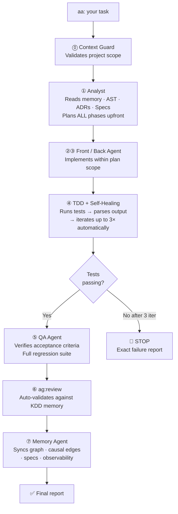

<div align="center">

<br/>

# ⚔️ Agentic KDD

### An army of one.
**One developer. The output of a full team.**  
*When you're ready to call for backup — a legion.*

<br/>

[](https://www.npmjs.com/package/agentic-kdd)
[](https://www.npmjs.com/package/agentic-kdd-mcp)
[](LICENSE)
[](https://nodejs.org)
[](https://cursor.sh)
[](https://claude.ai/code)

</div>

---

Most AI coding tools are assistants. They help you think faster, autocomplete your thoughts, answer questions.

Agentic KDD is not an assistant.

It's the architect who remembers every design decision. The QA engineer who never lets untested code through. The tech lead who knows every dependency in the codebase. The senior who learned from every past mistake. The PM who keeps the spec current after every cycle.

All of them. Inside your project. Every time you type `aa:`.

```bash
aa: implement JWT authentication with refresh tokens
```

*No interruptions. No context loss. No "can you remind me what we decided?"*

---

## Solo → Army of One

A single developer with Agentic KDD doesn't work like a developer with a smart autocomplete. They work like a **deployment-ready team** — because the system carries what a team would normally carry:

```
Without Agentic KDD            With Agentic KDD
───────────────────────        ─────────────────────────────────────────
You remember what you          The system remembers everything.
worked on last week.           Every error. Every decision. Every fix.

You explore the codebase       The AST graph knows every dependency
before touching anything.      before you write a single line.

You hope the agent ran         The harness gate blocks the step until
the tests it said it did.      tests are proven passing in code.

You start fresh each           Memory persists. Each cycle builds
session.                       on everything that came before.

You are one person.            You operate like a full team.
```

---

## Team → A Legion

When your team adopts collaborative mode, every developer's local memory syncs to a shared database (via [libSQL / Turso](https://turso.tech)).

```
Dev A discovers that touching auth.ts breaks session.ts
                        ↓
                  [ Turso Sync ]
                        ↓
Dev B already knows it — before touching auth.ts
Dev C already knows it — before touching auth.ts
Dev N already knows it — from day one on the project
```

One person's hard lesson becomes the team's permanent knowledge. The architectural decision from January is understood by the developer who joined in March — before they write a line.

```
One developer  +  Agentic KDD individual    =  An army of one
A team         +  Agentic KDD collaborative =  A legion
```

---

## How it works — the `aa:` pipeline

Every `aa: [task]` executes this **without interrupting you**:



**The developer never types `ag: test` or `ag: review` — they run automatically.**

---

## Memory Architecture — CoALA v3

Four memory layers, fully offline, in SQLite, living inside your project.

```
┌──────────────────────────────────────────────────────────────────────┐
│                                                                      │
│  WORKING        Active session buffer                                │
│  MEMORY    ──►  "what's in the context window right now"             │
│                                                                      │
│  EPISODIC       Raw trajectories of what happened                    │
│  MEMORY    ──►  "what was tried, in what order, what was the result" │
│                                                                      │
│  SEMANTIC       Project entity map + relationship graph              │
│  MEMORY    ──►  "what modules exist, how they connect"               │
│                                                                      │
│  PROCEDURAL     Patterns, errors, decisions                          │
│  MEMORY    ──►  "rules the agent applies on every cycle"             │
│                                                                      │
│  AST GRAPH      Symbols · call graph · imports · PageRank            │
│  (v3)      ──►  "the complete structural map of the codebase"        │
│                                                                      │
│  CAUSAL         caused_failure · was_fixed_by · regressed_by         │
│  EDGES (v3)──►  "what caused what — never deleted, only invalidated" │
│                                                                      │
│  KNOWLEDGE      ADRs · gotchas · conventions                         │
│  DOCS  (v3)──►  "why things were decided the way they were"          │
│                                                                      │
└──────────────────────────────────────────────────────────────────────┘
                                │
                      .agentic/memoria.db
              (SQLite · offline · ships with your project)
```

### Confidence signals

```
LOW    → suggestion, not enforced
MEDIUM → applied and mentioned in the plan
HIGH   → fixed rule, applied on every cycle without exception

Applied ≥ 3×  +  utility ≥ 70%  →  auto-promoted to MEDIUM
Applied ≥ 7×  +  utility ≥ 80%  →  auto-promoted to HIGH
Unused for 60 cycles             →  auto-degraded (temporal decay)
```

---

## Performance

```
Autonomy by phase
─────────────────────────────────────────────────────────────────
No framework               ████░░░░░░░░░░░░░░░░░░░░░░  20%
Agentic v2 core            ████████░░░░░░░░░░░░░░░░░░  40%
+ Harness        (Phase 0) ████████████░░░░░░░░░░░░░░  58%
+ AST + Causal   (Phase 1) ██████████████░░░░░░░░░░░░  70%
+ Knowledge Base (Phase 2) ████████████████░░░░░░░░░░  80%
+ Specs + Impact (Phase 3) █████████████████████████░  95%

Token reduction vs working without persistent memory
─────────────────────────────────────────────────────────────────
Short task   (fix / small feature)   ~8K  →  ~2K  tokens   −4×
Long task    (full feature)          ~80K →  ~8K  tokens  −10×
Large project  (50K+ lines)          ~120K→  ~8K  tokens  −15×
```

> **Source:** Codebase-Memory (arXiv 2603.27277, 2026) — 83% output quality with 10× fewer tokens using a graph-backed approach vs blind codebase exploration.

---

## The Five Phases

### Phase 0 — Harness: deterministic enforcement

The piece missing from every other agent framework.

Without gates, an agent can declare TDD complete without running a single test. With the harness, that is **impossible at the code level** — not at the prompt level.

```
Cursor Rules:   "Prefer running tests before delivering"
                → the agent follows this when it feels like it

Agentic KDD:    if (tests_passing === false) return STOP("deterministic gate")
                → the code rejects progress without proof of compliance
```

- **`harness.cjs`** — PRE/EXEC/POST gates for all 8 pipeline steps. No step advances without the gate verifying output.
- **`tdd-gate.cjs`** — mechanical self-healing loop in Node.js: detects test command, runs tests, parses output (Jest / Vitest / Mocha / pytest), retries up to 3×. The agent cannot lie about tests passing.
- **`harness-rules.md`** — strong imperative rules re-injected per step. Not suggestions — constraints the gate verifies.

### Phase 1 — Discernment: seeing the full codebase

Before planning any change, the agent has a complete structural map of the project.

- **`ast-indexer.cjs`** — AST graph (12 languages), regex fallback. Extracts functions, classes, imports, call graph → SQLite with PageRank scoring.
- **`causal-edges.cjs`** — bi-temporal causal memory. Edges are never deleted — they're invalidated, preserving the full history.

### Phase 2 — Knowledge Base: understanding *why*

> *"Code explains WHAT was built. ADRs explain WHY."*

- **`adr-ingestor.cjs`** — parses Architecture Decision Records in MADR format. Frontmatter → typed graph edges. No LLM required.
- **`knowledge-ingestor.cjs`** — ingests gotchas, conventions, and runbooks. A linter enforces structure before ingestion.

### Phase 3 — Autonomy: closing the loop at ~95%

- **`spec-manager.cjs`** — Kiro-style specs with wave execution. Wave 1 = tasks with no dependencies. Wave N = tasks that depend on Wave N-1.
- **`impact-analyzer.cjs`** — pre-change impact: AST + causal memory + knowledge base → CRITICAL / MEDIUM / LOW severity before touching anything.

### Phase 4 — Expansion

- **Multi-language** — same pipeline for JS/TS, Python, Go, Rust, Java, Kotlin, C++, PHP, Ruby, Swift, C#, Scala.
- **Collaborative mode** — libSQL / Turso Sync. Multiple developers share one agent memory.

---

## Installation

```bash
npm install -g agentic-kdd
cd my-project
akdd init
```

`akdd init` detects your stack, downloads the latest files from GitHub, installs dependencies, auto-configures the MCP server, and gives you one command to finish setup from the IDE.

```bash
# Open in Cursor or Claude Code, then:
aa: configure
```

After `aa: configure` the system maps your full codebase once. Then:

```bash
aa: [your task]
```

---

## CLI Reference

### Setup & diagnostics

| Command | Description |
|---------|-------------|
| `akdd init` | Deploy Agentic KDD in the current project |
| `akdd update` | Update agents + modules (memory untouched) |
| `akdd health` | Full diagnostic: what's configured, what's missing |
| `akdd health --fix` | Auto-fix detected issues |
| `akdd mcp` | Auto-configure MCP in Cursor / Claude Code |
| `akdd mcp status` | Check MCP configuration status |
| `akdd mcp --global` | Configure MCP globally for all projects |

### Memory

| Command | Description |
|---------|-------------|
| `akdd sync` | Sync markdown → SQLite graph |
| `akdd coala` | Stats across all 4 CoALA memory layers |
| `akdd buscar "query"` | Hybrid search across all memory |
| `akdd decay` | Apply temporal decay to inactive patterns |
| `akdd audit` | Memory audit: stale entries, contradictions, proposals |
| `akdd forget <id>` | Invalidate a memory entry with documented reason |

### AST & impact

| Command | Description |
|---------|-------------|
| `akdd ast` | Index project into the AST graph |
| `akdd ast stats` | AST index stats |
| `akdd ast-impact <file>` | Full impact analysis (AST + causal + knowledge) |
| `akdd why <entity>` | Why does this exist? (full causal chain) |

### Specs & autonomy

| Command | Description |
|---------|-------------|
| `akdd spec list` | List all module specs |
| `akdd spec <module>` | Spec status + next execution wave |
| `akdd spec create <module>` | Create a feature spec |
| `akdd spec create <module> --bugfix` | Create a bugfix spec |

### Knowledge base

| Command | Description |
|---------|-------------|
| `akdd adr` | Ingest ADRs from `docs/adr/` |
| `akdd knowledge` | Ingest gotchas and conventions |

### Metrics & observability

| Command | Description |
|---------|-------------|
| `akdd metrics` | KPIs: success rate, rework, autonomy score, token savings |
| `akdd metrics trend` | Trend across the last 10 cycles |
| `akdd trail` | Recent decision trails (what changed and why) |
| `akdd trail <cycle_id>` | Full trail of a specific cycle |
| `akdd trail why <entity>` | Why does this file or module exist? |

### Intelligence

| Command | Description |
|---------|-------------|
| `akdd git-context` | Git diff analysis + risk assessment |
| `akdd predict` | Predictive risk patterns from episodic memory |
| `akdd embed-install` | Install local embeddings (~23MB, 100% offline) |
| `akdd ci-install` | Install GitHub Actions CI/CD memory workflow |
| `akdd dashboard` | Open interactive visual dashboard in browser |

---

## MCP Server — 23 native tools

After `akdd init`, Cursor and Claude Code discover the MCP server automatically. Every tool is available directly in the IDE chat.

```json
// .cursor/mcp.json — written automatically by akdd init
{
  "mcpServers": {
    "agentic-kdd": {
      "command": "node",
      "args": [".agentic/grafo/mcp-server.cjs"]
    }
  }
}
```

| Tool | Category |
|------|----------|
| `grafo_buscar` · `verdad_vigente` · `grafo_predecir` | Memory |
| `ast_impact` · `ast_index` · `ast_symbols` · `impact_precheck` · `impact_diff` | AST |
| `spec_waves` · `spec_status` · `spec_create` | Specs |
| `knowledge_query` · `adr_ingest` | Knowledge |
| `causal_add` · `causal_query` | Causal memory |
| `decision_trail` · `decision_why` · `recent_ciclos` · `metrics_summary` | Observability |
| `health_check` · `memory_audit` · `memory_forget` | Diagnostics |

---

## How it compares

| | Agentic KDD v3 | Cursor Rules | GitHub Copilot | LangGraph | CrewAI |
|---|:---:|:---:|:---:|:---:|:---:|
| Persistent memory between sessions | ✅ | ❌ | ❌ | ⚠️ | ❌ |
| Deterministic enforcement gates | ✅ | ❌ | ❌ | ⚠️ | ❌ |
| Full codebase AST graph | ✅ | ❌ | ⚠️ | ❌ | ❌ |
| Knowledge base (ADRs / gotchas) | ✅ | ❌ | ❌ | ❌ | ❌ |
| Mechanical self-healing in code | ✅ | ❌ | ❌ | ⚠️ | ❌ |
| Autonomous 8-step pipeline | ✅ | ❌ | ❌ | ✅ | ✅ |
| 100% offline | ✅ | ✅ | ❌ | ⚠️ | ❌ |
| Lives inside the project (no SaaS) | ✅ | ✅ | ❌ | ❌ | ❌ |
| Native MCP server (23 tools) | ✅ | ❌ | ❌ | ❌ | ❌ |
| Collaborative shared memory | ✅ | ❌ | ❌ | ❌ | ❌ |

---

## Switching IDEs

Memory lives in the project, not the IDE. When switching from Cursor to Claude Code (or back):

```bash
akdd mcp
```

That's the only step.

---

## Updating an existing project

```bash
akdd update
```

Downloads the latest modules from GitHub. Schema migrations run automatically on the next cycle. **Memory stays intact.**

---

## Project structure after `akdd init`

```
your-project/
├── .agentic/
│   ├── agentes/              9 agents + 4 pro (markdown)
│   ├── grafo/                19 Node.js modules
│   │   ├── grafo.cjs         memory engine (CoALA v3)
│   │   ├── harness.cjs       pipeline enforcement
│   │   ├── tdd-gate.cjs      mechanical self-healing
│   │   ├── ast-indexer.cjs   AST graph (12 languages)
│   │   ├── causal-edges.cjs  bi-temporal causal memory
│   │   ├── adr-ingestor.cjs  knowledge base
│   │   ├── spec-manager.cjs  Kiro-style wave execution
│   │   ├── impact-analyzer.cjs  pre-change impact
│   │   ├── decision-trail.cjs   decision observability
│   │   ├── metrics.cjs          project KPIs
│   │   ├── memory-audit.cjs     memory governance
│   │   ├── health-check.cjs     system diagnostics
│   │   ├── mcp-server.cjs       23 MCP tools
│   │   └── collab-manager.cjs   collaborative sync
│   ├── memoria/              patterns · errors · decisions
│   ├── specs/                module specs with wave execution
│   ├── conocimiento/         ADRs · gotchas · conventions
│   ├── config.md             project stack and rules
│   └── memoria.db            SQLite — all memory lives here
├── .cursor/mcp.json          auto-configured by akdd init
├── .audit/                   7 specialized QA agents
├── dashboard.cjs             interactive visual dashboard
├── CLAUDE.md                 activates aa: / ag: / audit:
└── .cursorrules              Cursor rules
```

---

## Packages

| Package | |
|---------|---|
| [`agentic-kdd`](https://www.npmjs.com/package/agentic-kdd) | CLI: init, update, health, ast, metrics, trail, mcp and more |
| [`agentic-kdd-mcp`](https://www.npmjs.com/package/agentic-kdd-mcp) | Standalone MCP server: 23 tools for Cursor and Claude Code |

---

## License

MIT © [Adrianlpz211](https://github.com/Adrianlpz211)

---

<div align="center">

<br/>

**[npm](https://www.npmjs.com/package/agentic-kdd)** · **[mcp](https://www.npmjs.com/package/agentic-kdd-mcp)** · **[github](https://github.com/Adrianlpz211/Agentic-KDD)**

<br/>

*An army of one.*  
*When you're ready to call for backup — a legion.*

</div>
